# Práctica 1 - Spring Boot: Instalación y Primer Endpoint

**Autor:** Emanuel Leon  
**Materia:** Programación y Plataformas Web  
**Universidad:** Universidad Politécnica Salesiana

---

## 1. Verificación de Java

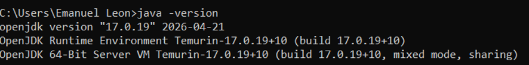

---

## 2. Servidor Spring Boot ejecutándose

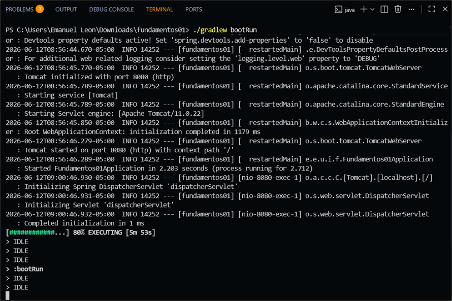

---

## 3. Endpoint `/api/status` funcionando

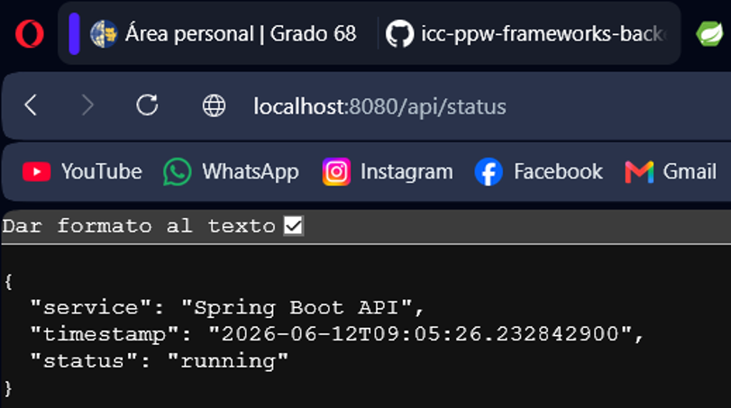

---

## 4. Archivo StatusController.java

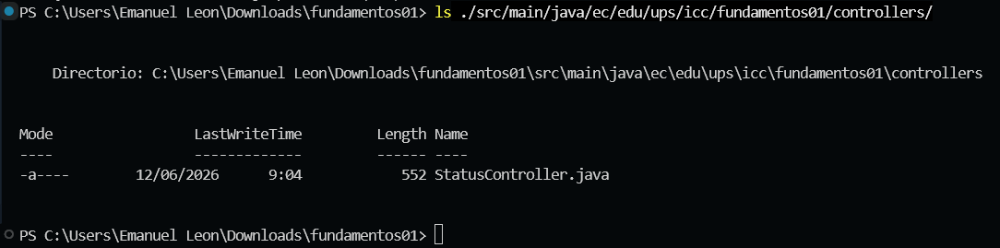

---

## 5. Explicación

El endpoint `/api/status` responde a peticiones GET y devuelve un JSON con el nombre del servicio, su estado y la fecha y hora actual. Sirve para verificar que la aplicación está corriendo correctamente.

Spring Boot facilita la creación de servidores web en Java al incluir un servidor Tomcat embebido que se inicia automáticamente con la aplicación, sin necesidad de configuraciones externas.

# Práctica 3: API Rest
## Capturas 18/06/2026

#### 1.- Localhost del nuevo recurso Students:

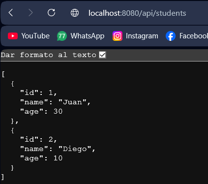

#### 2.- Students/count:

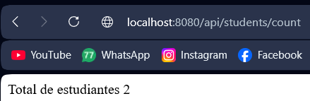

# Práctica 5 (Spring Boot): Persistencia real con PostgreSQL, Entidades JPA y Repositorios

## Evidencias:

#### 1.- Aplicación Docker Desktop:

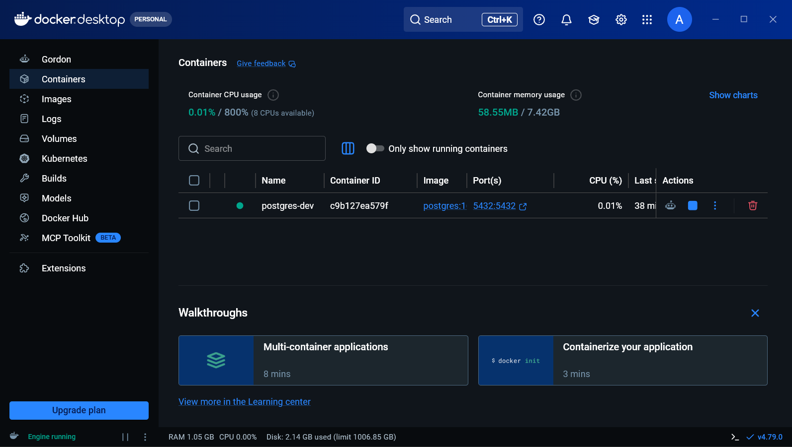

#### 2.- Verificación en PostgreSQL:

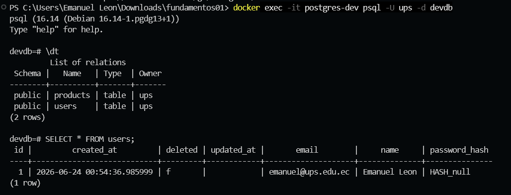

### Creación de clases en ```/products```:

## Evidencias:

#### 1.- Visualización de los 5 productos:

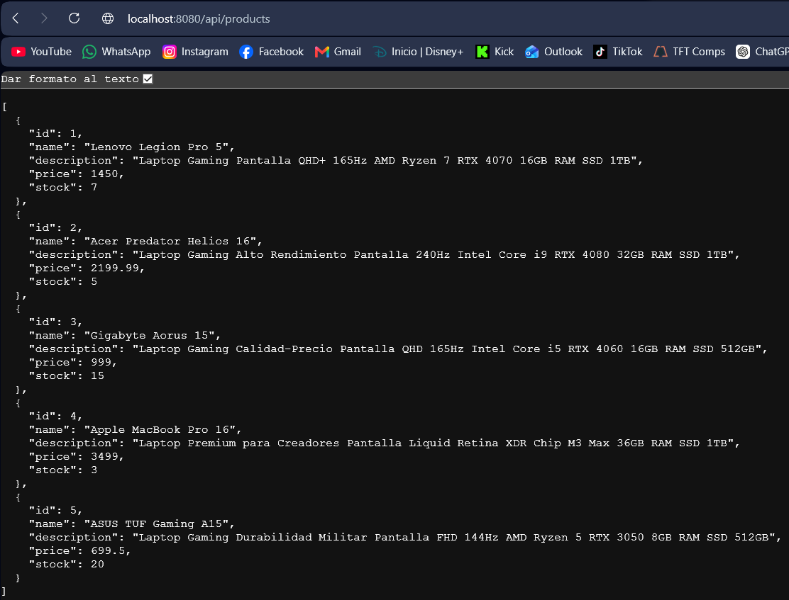

**Descripción:** Se insertaron 5 registros de productos a través de BRUNO.

#### 2.- Verificación de un producto en especifico:

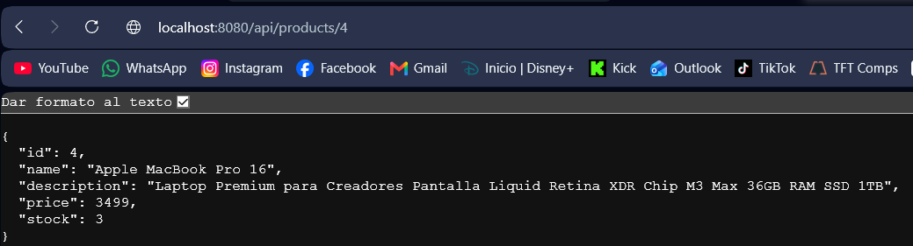


#### 3.- Verificación en PostgreSQL:

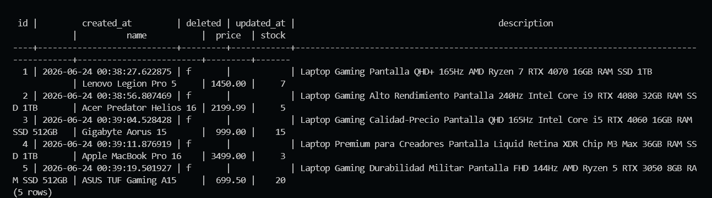


## Flujo de datos: API REST ↔ PostgreSQL

Cuando el cliente realiza una petición HTTP con un JSON, el `ProductsController` recibe los datos mediante un `CreateProductDto`. Este pasa al `ProductServiceImpl`, que usa `ProductMapper` para transformarlo a `ProductEntity`. Al ser `ProductEntity` hija de `BaseEntity`, los callbacks `@PrePersist` y `@PreUpdate` asignan automáticamente los campos de auditoría (`id`, `createdAt`, `updatedAt`). Finalmente el `ProductRepository` ejecuta `.save()` y Hibernate traduce la entidad a un `INSERT` en PostgreSQL.

En el sentido inverso, PostgreSQL retorna el registro, Hibernate lo mapea a `ProductEntity`, el `ProductMapper` lo convierte a `ProductResponseDto` y el controlador lo devuelve al cliente como JSON.

`BaseEntity` centraliza los campos comunes evitando duplicación en cada entidad del proyecto.

# Práctica 6 (Spring Boot): Validación de DTOs y Control de Datos de Entrada


## Evidencias

### 1. POST inválido con precio negativo y nombre vacío


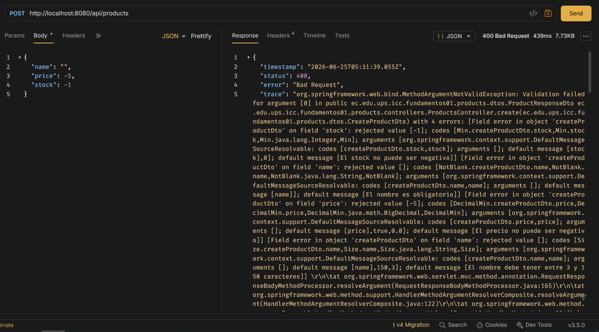

---

### 2. DELETE de un producto y reintento

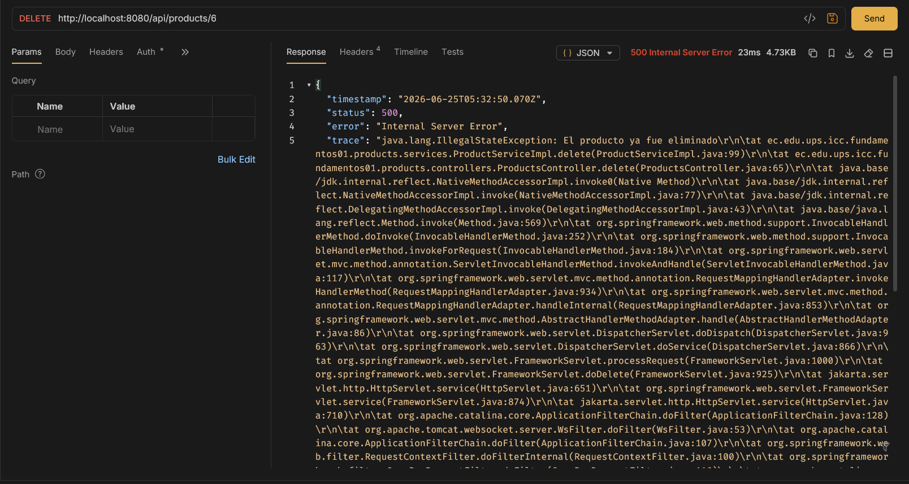

---

### 3. GET después del delete — producto eliminado no aparece

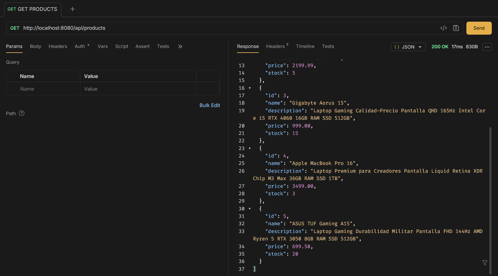


# Práctica 7 (Spring Boot): Manejo Global de Errores y Excepciones


## 1. Error por producto inexistente

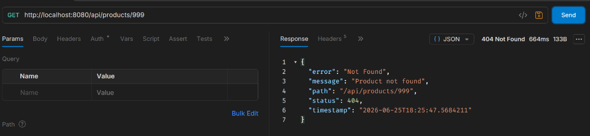

---

## 2. Error por producto duplicado

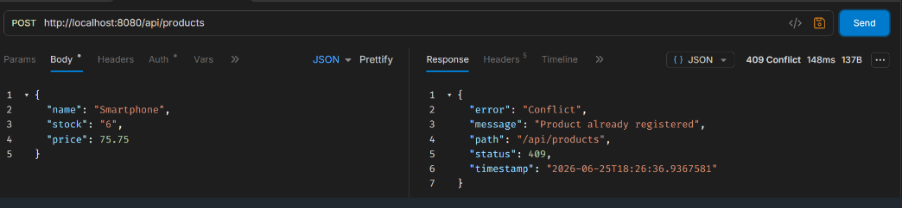


## 3. Error por validación de DTO

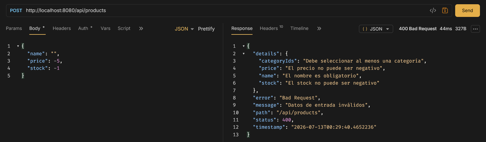

---

## Preguntas

**¿Por qué es mejor centralizar el manejo de errores en un `GlobalExceptionHandler` en vez de usar `try/catch` en cada controlador?**
Porque evita duplicar la misma lógica de manejo de errores en cada controlador y garantiza que todas las respuestas de error tengan el mismo formato (`ErrorResponse`), sin importar en qué parte de la aplicación ocurrió el problema. Además, mantiene los controladores y servicios enfocados solo en la lógica de negocio, sin mezclar responsabilidades de construcción de respuestas HTTP.

**¿Cuál es la diferencia entre una excepción de validación (`MethodArgumentNotValidException`) y una excepción de dominio (`NotFoundException`, `ConflictException`, `BadRequestException`)?**
La excepción de validación ocurre **antes** de que la petición llegue al servicio, cuando falla una anotación de `@Valid` sobre el DTO (por ejemplo, un campo obligatorio vacío); en ese caso el servicio nunca llega a ejecutarse. Las excepciones de dominio, en cambio, se lanzan **dentro** del servicio cuando los datos son sintácticamente válidos pero violan una regla de negocio (por ejemplo, un recurso no existe o un nombre ya está registrado). Ambas terminan devolviendo un `ErrorResponse` con formato consistente, pero por caminos y momentos distintos del flujo de la petición.


# Práctica 8 (Spring Boot): Relaciones ManyToOne, Foreign Keys y Consultas Relacionales


## 1. Estructura de la tabla `products` en PostgreSQL

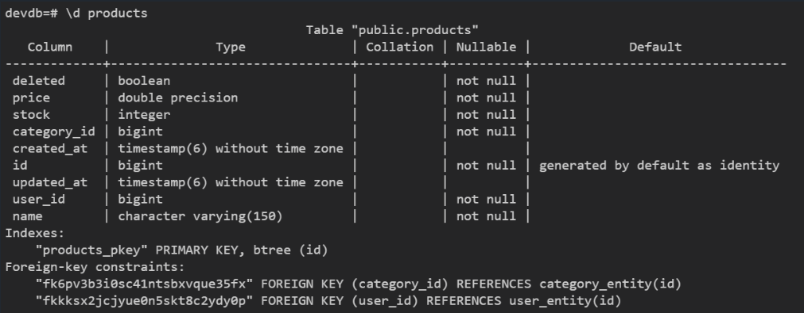


## 2. Creación de producto con relaciones


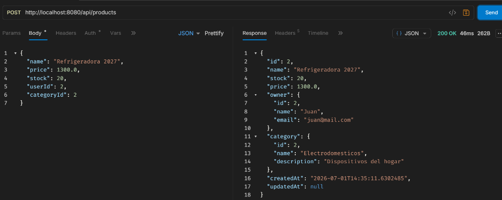

---

## 3. Consulta de productos por categoría

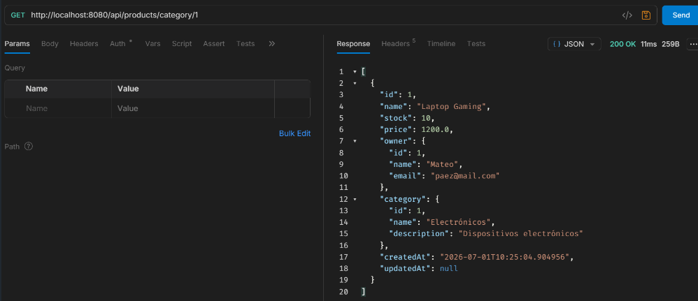

---

## Explicación

**¿Cómo se relaciona `ProductEntity` con `UserEntity` y `CategoryEntity` usando `@ManyToOne` y `@JoinColumn`?**

`ProductEntity` define dos relaciones `@ManyToOne`, una hacia `UserEntity` (campo `owner`) y otra hacia `CategoryEntity` (campo `category`), porque muchos productos pueden pertenecer a un mismo usuario y a una misma categoría. Cada relación se acompaña de un `@JoinColumn` que indica el nombre de la columna de clave foránea que se crea en la tabla `products` (`user_id` y `category_id` respectivamente), la cual referencia el `id` de la tabla `users` o `categories`. Ambas relaciones se configuran con `fetch = FetchType.LAZY` para que el usuario y la categoría solo se carguen desde la base de datos cuando realmente se accede a ellos (por ejemplo, al construir el `ProductResponseDto`), evitando consultas innecesarias y mejorando el rendimiento en listados grandes. Además, `optional = false` obliga a que todo producto tenga siempre un usuario y una categoría asociados, por lo que antes de guardar un producto el servicio valida que ambos existan y no estén eliminados lógicamente.


# Práctica 9 (Spring Boot): Request Parameters, Consultas Relacionadas y Filtrado con JPA

## Autor
**Pablo Torres**
GitHub: PabloT18

---

## 1. Producto creado con varias categorías

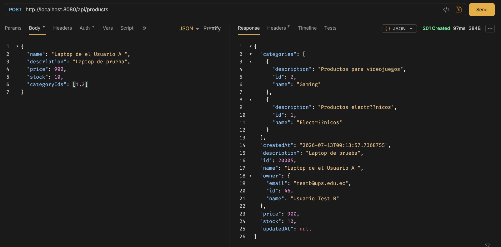

---

## 2. Consulta con filtros por usuario

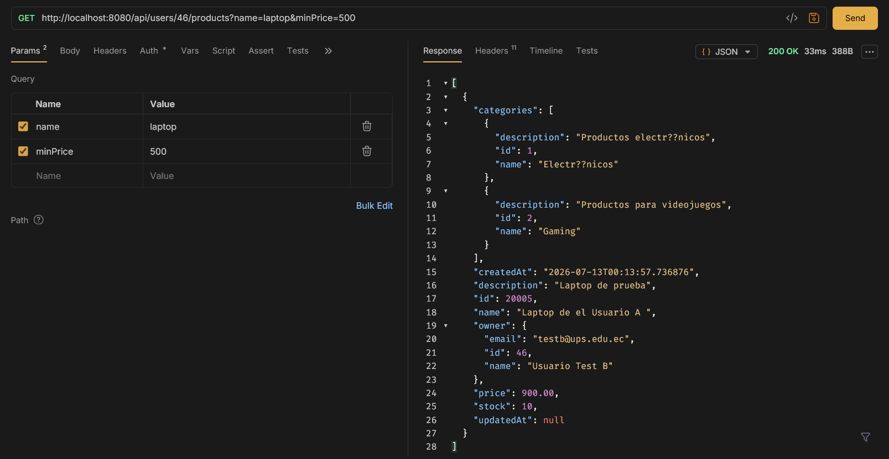

---

## 3. Consulta con filtros por categoría

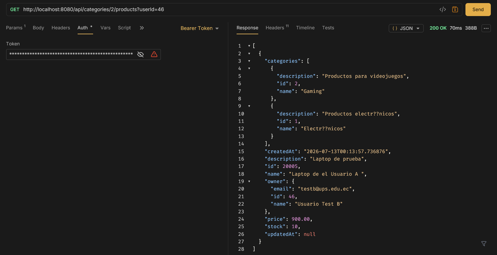

---

## Preguntas

**¿Por qué se usa `ProductService` y `ProductRepository` para consultar productos aunque el endpoint esté dentro del contexto `/users/{id}/products` o `/categories/{id}/products`?**
Porque el recurso que realmente se está consultando es `products`, no `users` ni `categories`. La ruta solo define el contexto semántico desde el que se accede (por ejemplo, "los productos de este usuario"), pero la responsabilidad de consultar y filtrar productos sigue perteneciendo al servicio y repositorio de productos. Esto evita duplicar lógica de negocio en varios controladores y mantiene la consulta optimizada directamente contra la tabla `products` con filtros aplicados en base de datos, en lugar de navegar colecciones cargadas en memoria desde `UserEntity` o `CategoryEntity`.

**¿Qué cambió al pasar de `Product N ──── 1 Category` a `Product N ──── N Category`?**
Se eliminó la relación `@ManyToOne` con una columna `category_id` en la tabla `products`, y se reemplazó por una relación `@ManyToMany` con una tabla intermedia `product_categories`. Esto implicó: cambiar `categoryId` por `categoryIds` en los DTOs de creación/actualización, devolver una lista de categorías en `ProductResponseDto` en vez de una sola, actualizar el mapper para convertir colecciones, y modificar las consultas JPQL usando `JOIN p.categories` con `DISTINCT` para evitar productos duplicados cuando coinciden con varias categorías.


# Práctica 10 (Spring Boot): Paginación de Productos con Page, Slice y Pageable


## 2. Respuesta con Page

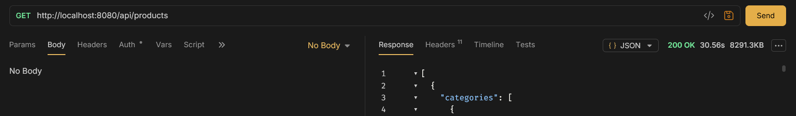

---

## 3. Respuesta con Slice

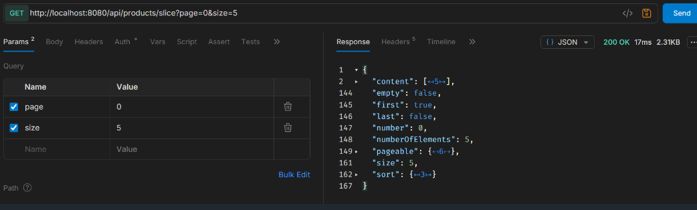

---

## 4. Error por paginación inválida


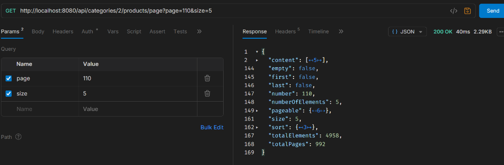

---

## 5. Productos por categoría paginados (Page)


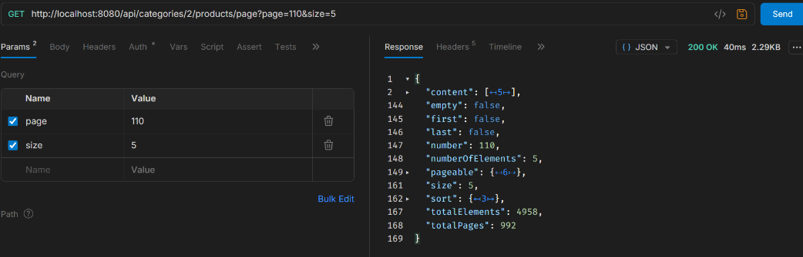

---

## 6. Productos por categoría paginados (Slice)


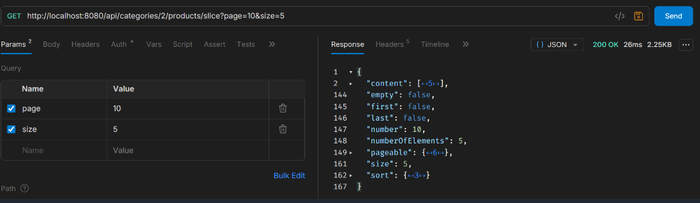

---

## Preguntas

**¿Cuál es la diferencia entre `Page` y `Slice`?**
`Page` ejecuta una consulta adicional `COUNT` para calcular `totalElements` y `totalPages`, lo que la hace más completa pero más costosa. `Slice` no ejecuta ese `COUNT`; solo sabe si existe una página siguiente, por lo que es más liviana y rápida, ideal para scroll infinito o navegación simple sin necesidad de mostrar el total de registros.

**¿Por qué la paginación debe aplicarse en el repositorio y no después de traer todos los datos en memoria?**
Porque si se trae todo a memoria y se pagina después (por ejemplo con `.subList()` en Java), la base de datos igual tuvo que leer y transportar todos los registros, perdiendo toda la ventaja de rendimiento. Al aplicar `LIMIT`/`OFFSET` directamente en la consulta SQL (a través de `Pageable`), la base de datos solo lee y devuelve los registros necesarios, reduciendo tiempo de consulta, uso de memoria y tráfico de red.


# Práctica 11 (Spring Boot): Autenticación JWT, Roles y Protección de Endpoints

---

## 1. Registro exitoso

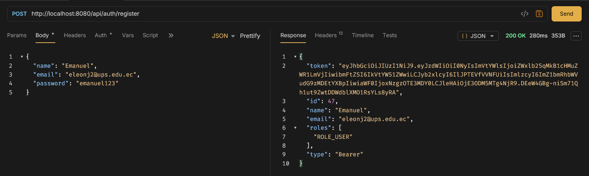

---

## 2. Login exitoso

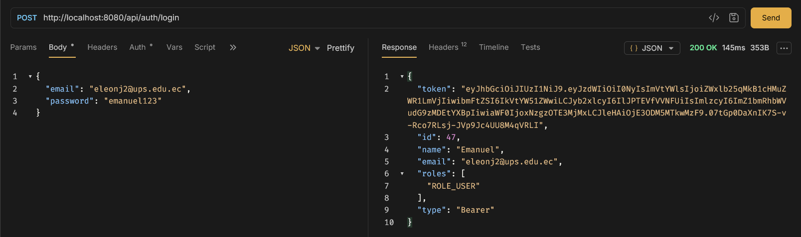

---

## 3. Endpoint protegido sin token

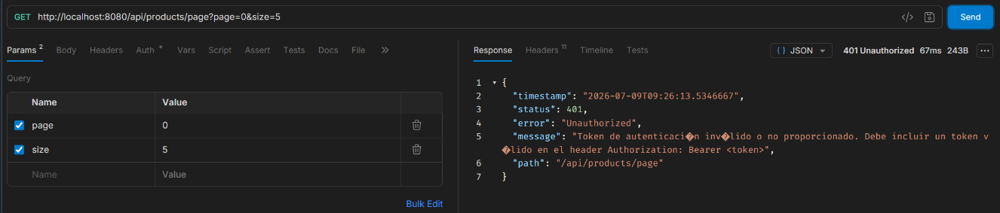

---

## 4. Endpoint protegido con token

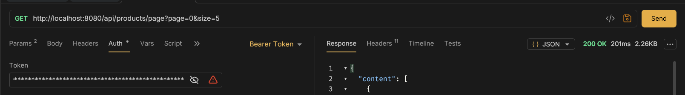

---

## Preguntas

**¿Qué es autenticación y qué es autorización?**
Autenticación es verificar quién es el usuario (login con email/contraseña, validado con un token JWT). Autorización es verificar qué puede hacer ese usuario una vez identificado (por ejemplo, según su rol).

**¿Por qué se usa JWT en vez de sesiones tradicionales?**
JWT es stateless: el servidor no guarda nada en memoria ni en base de datos sobre la sesión, toda la información va firmada dentro del propio token. Esto permite que la API escale sin necesidad de sincronizar sesiones entre servidores, y es ideal para APIs REST y clientes móviles/SPA.

**¿Por qué las contraseñas se guardan con BCrypt y no en texto plano?**
Porque BCrypt genera un hash irreversible con salt aleatorio, así que si la base de datos se filtra, las contraseñas reales no quedan expuestas. Cada vez que se hashea la misma contraseña el resultado es distinto, y solo se puede validar comparando (`matches`), nunca revertir el hash.

**¿Qué diferencia hay entre `JwtAuthenticationFilter` y `JwtAuthenticationEntryPoint`?**
El filtro se ejecuta en cada petición para validar el token y, si es válido, coloca al usuario autenticado en el `SecurityContext`. El `EntryPoint` solo actúa cuando la autenticación falla (token ausente, inválido o expirado), y es el encargado de devolver la respuesta `401` en formato JSON.


# Práctica 12 (Spring Boot): Protección de Endpoints con Roles

## 1. Usuario autenticado (`/users/me`)

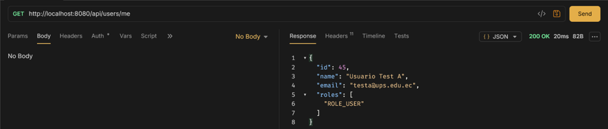

---

## 2. Acceso denegado por rol

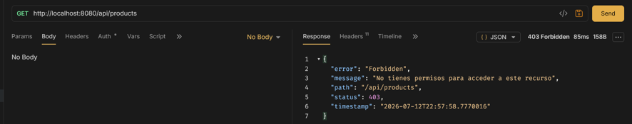
---

## 3. Acceso permitido con ROLE_ADMIN

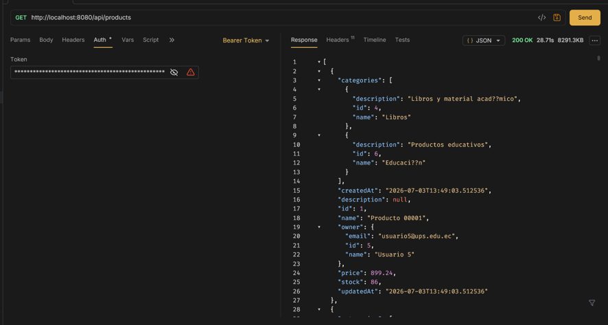

---

## Preguntas

**¿Cuál es la diferencia entre autenticación y autorización?**
La autenticación valida quién eres (token JWT válido). La autorización valida qué puedes hacer una vez autenticado (si tienes el rol necesario para esa acción).

**¿Por qué `GET /api/products` debe ser solo para ADMIN, mientras `GET /api/products/page` puede ser consumido por cualquier usuario autenticado?**
Porque `/products` devuelve todos los productos sin paginación, lo que puede exponer un volumen grande de datos y afectar el rendimiento. `/products/page` sí pagina los resultados, por lo que es seguro y eficiente para cualquier usuario autenticado.


# Práctica 13 (Spring Boot): Validación de Ownership


## 1. Creación y actualizacion de producto con usuario autenticado

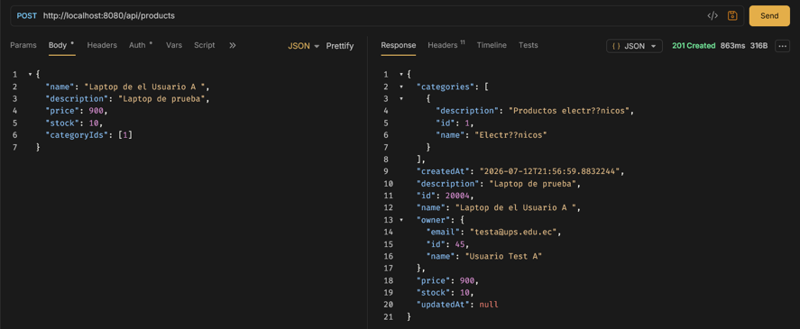
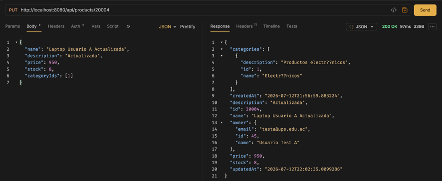

---

## 2. Bloqueo por producto ajeno (UPDATE)

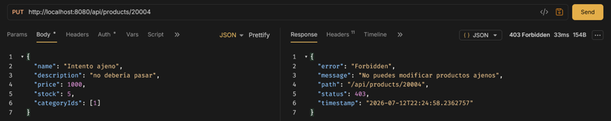

---

## 3. Bloqueo por producto ajeno (DELETE)


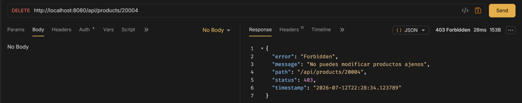

---

## 4. ADMIN modificando producto ajeno


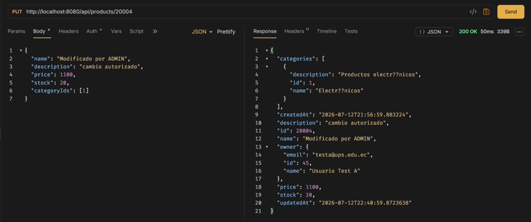

---

## 5. ADMIN eliminando producto ajeno


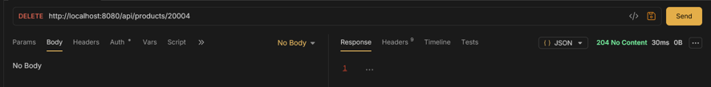

---

## Preguntas

**¿Qué es ownership?**
Es la validación de que un recurso pertenece a un usuario específico, y que solo el dueño (o un ADMIN) puede modificarlo o eliminarlo.

**¿Por qué no es seguro recibir `userId` en `CreateProductDto`?**
Porque el cliente podría enviar el `id` de otro usuario y crear productos a su nombre. El owner debe salir del token JWT, no del body.

**¿Cuál es la diferencia entre autorización por rol y autorización por ownership?**
El rol define qué puede hacer un tipo de usuario en general (ej. solo ADMIN lista todo sin paginar). El ownership valida si el usuario autenticado es dueño del recurso puntual que quiere modificar, comparando su id con el `owner_id` del recurso.